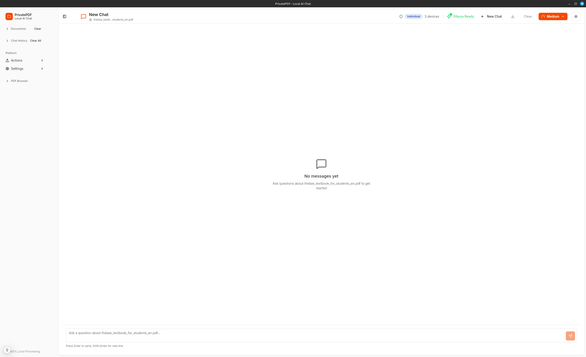

# PrivatePDF

> Chat with your PDFs using local AI. 100% private - nothing leaves your computer.

[](https://www.typescriptlang.org/)
[](https://nextjs.org/)
[](https://tauri.app/)
[](LICENSE)

<p align="center">
  
</p>

<p align="center">
  <em>Chat with your PDFs privately - all AI processing happens locally on your machine</em>
</p>

## Download

| Platform | Download |
|----------|----------|
| **Windows** | [PrivatePDF_1.0.0_x64-setup.exe](https://github.com/ggeo/privatepdf_personal/releases/latest) |
| **Linux (Debian/Ubuntu)** | [PrivatePDF_1.0.0_amd64.deb](https://github.com/ggeo/privatepdf_personal/releases/latest) |
| **Linux (Fedora/RHEL)** | [PrivatePDF_1.0.0_x86_64.rpm](https://github.com/ggeo/privatepdf_personal/releases/latest) |

## Quick Start

### 1. Install PrivatePDF
- **Windows**: Run the `.exe` installer
- **Linux**: Install with `sudo dpkg -i PrivatePDF_*.deb` or `sudo rpm -i PrivatePDF_*.rpm`

### 2. Set Up Ollama (AI Engine)
On first launch, PrivatePDF will guide you to install Ollama:
1. Click **"Setup Ollama"** when prompted
2. Download and install Ollama from [ollama.com](https://ollama.com)
3. Return to PrivatePDF and click **"Start Ollama"**

### 3. Download AI Model
1. Click **"Download Recommended Model"**
2. Wait for download (~815MB, one-time only)

### 4. Chat with PDFs
1. Click **"+"** to upload a PDF
2. Wait for processing (extracts text and creates embeddings)
3. Type your question and press Enter
4. Get answers with page citations!

## Features

- **100% Private** - All processing happens locally via Ollama
- **No API Costs** - AI runs on your machine, no cloud fees
- **Works Offline** - After initial setup, no internet needed
- **Source Citations** - See which pages answers come from
- **Multi-Document** - Chat across multiple PDFs at once

## Privacy

Your documents never leave your computer:
- PDFs are processed locally
- AI runs via Ollama on your machine
- Data stored in local IndexedDB
- No analytics or tracking

---

## For Developers

### Prerequisites

- [Bun](https://bun.sh) (v1.0+)
- [Node.js](https://nodejs.org) (v18+)
- [Rust](https://rustup.rs) (for Tauri builds)
- [Ollama](https://ollama.com) (for AI inference)

### Setup

```bash
# Clone the repository
git clone https://github.com/ggeo/privatepdf_personal.git
cd privatepdf_personal

# Install dependencies
bun install

# Copy environment variables
cp .env.example .env.local
```

### Regenerating Dependencies

If you need to rebuild from scratch or fix dependency issues:

```bash
# Regenerate node_modules (JavaScript dependencies)
rm -rf node_modules
bun install

# Regenerate src-tauri/target (Rust compilation cache)
rm -rf src-tauri/target
bun run tauri:build   # or: bun run tauri dev
```

**Note**: First Rust build takes 5-10 minutes. Subsequent builds are faster due to caching.

### Development

```bash
# Start the Next.js dev server
bun run dev

# Open in browser
# http://localhost:3000
```

### Building Desktop App

```bash
# Build the Tauri desktop app
bun run tauri:build

# Installers will be in:
# - src-tauri/target/release/bundle/nsis/ (Windows .exe)
# - src-tauri/target/release/bundle/deb/ (Linux .deb)
# - src-tauri/target/release/bundle/rpm/ (Linux .rpm)
```

See [BUILD_INSTRUCTIONS.md](BUILD_INSTRUCTIONS.md) for detailed build steps.

### Project Structure

```
privatepdf/
├── src/
│   ├── app/              # Next.js pages
│   ├── components/       # React components
│   ├── lib/              # Core libraries & services
│   └── stores/           # Zustand state management
├── src-tauri/            # Tauri/Rust backend
└── public/               # Static assets
```

### Tech Stack

- **Frontend**: Next.js 15, TypeScript, Tailwind CSS, Radix UI
- **Desktop**: Tauri v2 (Rust backend)
- **AI**: Ollama (local LLM inference)
- **PDF**: pdf.js (Mozilla)
- **Storage**: IndexedDB (browser), SQLite (desktop)

## License

MIT License - see [LICENSE](LICENSE) for details.

## Contributing

Contributions welcome! Please open an issue or PR.
